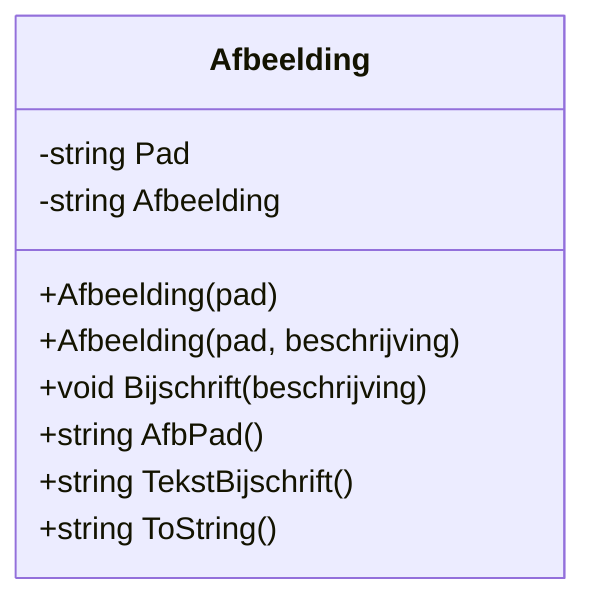

```mermaid
classDiagram
    class Afbeelding {
        -string Pad
        -string Afbeelding
        +Afbeelding(pad)
        +Afbeelding(pad, beschrijving)
        +void Bijschrift(beschrijving)
        +string AfbPad()
        +string TekstBijschrift()
        +string ToString()
}
```
